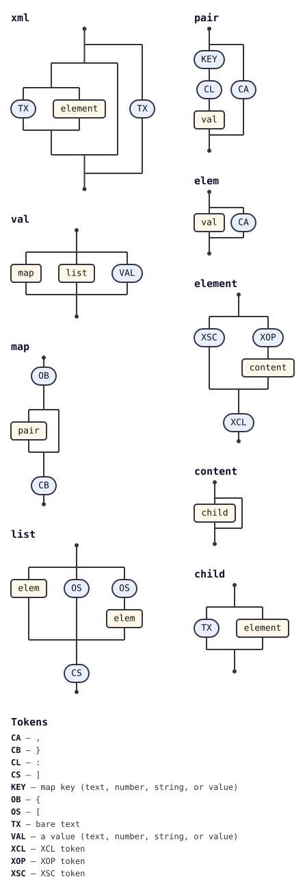

# @tabnas/feed

<!-- tabnas-badges -->
[](https://www.npmjs.com/package/@tabnas/feed)
[](https://github.com/tabnas/feed/actions/workflows/ci.yml)
[](https://pkg.go.dev/github.com/tabnas/feed/go)
[](https://tabnas.github.io/status/)
<!-- /tabnas-badges -->

Parses RSS (0.90, 0.91, 0.92, 1.0, 2.0) and Atom (0.3, 1.0) syndication
feeds into a typed structure. By default every dialect is normalised to
a single **Atom-shaped** result, so the same downstream code can consume
feeds from any source. It is a plugin for the
[`tabnas`](https://github.com/tabnas/parser) parsing engine, built on top
of [`@tabnas/xml`](https://github.com/tabnas/xml), and ships in two
languages with identical output.

Docs, guides, the error reference and the playground: **[tabnas.dev](https://tabnas.dev)**.

## Install

```bash
# TypeScript / JavaScript
npm install @tabnas/feed @tabnas/parser @tabnas/jsonic @tabnas/xml

# Go
go get github.com/tabnas/feed/go
```

## One tiny example

**TypeScript** — hand in RSS, get Atom shape out:

```ts
import { Tabnas } from '@tabnas/parser'
import { jsonic } from '@tabnas/jsonic'
import { Feed } from '@tabnas/feed'

const j = new Tabnas().use(jsonic).use(Feed)
const feed = j.parse('<rss version="2.0"><channel><title>My Blog</title></channel></rss>')

feed.title    // { type: 'text', value: 'My Blog' }
feed.format   // 'atom'
```

**Go** — the same, returning a typed struct:

```go
j := tabnasjsonic.Make()
j.UseDefaults(tabnasfeed.Feed, tabnasfeed.Defaults)
got, _ := j.Parse(`<rss version="2.0"><channel><title>My Blog</title></channel></rss>`)
f := got.(tabnasfeed.AtomFeed)
fmt.Println(f.Title.Value) // My Blog
```

The input was RSS 2.0 but the result is in Atom shape — `title` is an
`AtomText` (`{ type, value }`), and the whole object follows RFC 4287.
Pass `{ format: 'native' }` to keep the source dialect's structure, or
`{ format: 'raw' }` for the underlying XML element tree.

Feeds are namespace-defined formats, so `@tabnas/feed` enforces
Namespaces in XML 1.0 by default: an undeclared prefix such as
`<dc:language>` with no `xmlns:dc` is an error. Pass
`{ strictNamespaces: false }` for the laxer bare-XML behaviour.

## Conformance

RSS/Atom have no single canonical test suite. The authoritative third-party
corpus is **rubys/feedvalidator**, the suite behind the W3C Feed Validation
Service, and the whole `testcases/` tree is wired into this repo's `make
test` — both halves asserted, in TypeScript and Go:

- 1809/1809 well-formed RSS/Atom documents accepted;
- 1108/1108 with the dialect the corpus directory says they are;
- 18/18 not-well-formed documents rejected.

Separately, 1734/1734 (100%) of the RSS/Atom-rooted well-formed documents in
**kurtmckee/feedparser** parse to an Atom shape — measured, but not yet
asserted by a committed harness.

See [`AGENTS.md`](AGENTS.md#conformance-what-is-actually-verified) for how
the corpora are fetched, which documents fall outside the RSS/Atom claim, and
the one remaining `@tabnas/xml` gap.

## Documentation

Full docs follow the four [Diátaxis](https://diataxis.fr) quadrants,
one file each, per language:

| Quadrant   | TypeScript                              | Go                                      |
| ---------- | --------------------------------------- | --------------------------------------- |
| Tutorial   | [ts/doc/tutorial.md](ts/doc/tutorial.md) | [go/doc/tutorial.md](go/doc/tutorial.md) |
| How-to     | [ts/doc/guide.md](ts/doc/guide.md)       | [go/doc/guide.md](go/doc/guide.md)       |
| Reference  | [ts/doc/reference.md](ts/doc/reference.md) | [go/doc/reference.md](go/doc/reference.md) |
| Concepts   | [ts/doc/concepts.md](ts/doc/concepts.md) | [go/doc/concepts.md](go/doc/concepts.md) |

Language hubs: [`ts/README.md`](ts/README.md) and
[`go/README.md`](go/README.md).

## Repository layout

| Path                                                            | Description                                  |
| -------------------------------------------------------------- | -------------------------------------------- |
| [`ts/`](ts/)                                                   | Canonical TypeScript / JavaScript implementation. |
| [`go/`](go/)                                                   | Go port (`github.com/tabnas/feed/go`).       |
| [`test/spec/`](test/spec/)                                    | Shared `.tsv` conformance fixtures, run by both runtimes. |
| [`test/feedparser-wellformed/`](test/feedparser-wellformed/)  | Vendored well-formed corpus (BSD 2-Clause).  |

## Grammar diagram

`@tabnas/feed` contributes no grammar of its own — the accepted syntax
is the XML grammar from `@tabnas/xml`. The installed grammar as a
railroad / syntax diagram, generated with
[`@tabnas/railroad`](https://github.com/tabnas/railroad):



A vertical ASCII version is in [`ts/doc/grammar.txt`](ts/doc/grammar.txt).

## License

MIT. Copyright (c) Richard Rodger and contributors.
